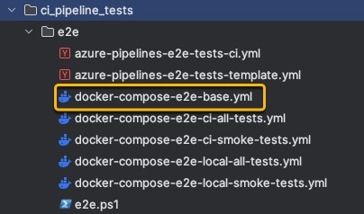

+++
title = 'Automate end-to-end tests on your machine.'
date = 2024-04-10T15:37:06-05:00
featured_image = 'overview-design.png'
draft = true 
+++


# Docker compose set up
In order to to spin up containers locally or do so in the CI pipeline,
and to run just the "smoke tests" or for all tests, I created multiple docker compose files.

Then common functionality is extracted into "base" docker compose file from which others will extend.




# Run tests locally

In order to test, you can spin up the docker containers locally.
There are multiple things that you need to do to avoid confusion.

Things like:

- stop running containers
- remove containers
- remove volumes that have stale data
- remove dangling images
- remove existing images for UI and backend API
- spin up new services with docker compose
- copy tests results into specific directory

After doing these steps manually a couple of times (and forgetting to do them) it was time to automate these steps.


Here is a powershell script that I came up with that will run either smoke tests or all tests. It will also take care of tearing down and spinning up of containers as well as copying test results into specified directory.

```powershell
#
# Helper powershell script to automate testing on local machine.
#
Function Get-TypeOfTest {
  $type=Read-Host "
    1 - All Tests
    2 - Smoke Tests
    Please choose"
  Switch ($type){
    1 {$choice="all"}
    2 {$choice="smoke"}
  }
  return $choice
}

$testType=Get-TypeOfTest

# Use docker compose file according to user's selection of tests
$dockerComposeFile = ".\docker-compose-e2e-local-$testType-tests.yml"

# stop and remove containers defined in the compose file
docker compose -f .\docker-compose-e2e-base.yml -f $dockerComposeFile down

# remove images so they can be rebuilt
$api_image=$(docker images --format "{{.Repository}}:{{.Tag}}"|findstr "api_for_ci_e2e_test")
$ui_image =$(docker images --format "{{.Repository}}:{{.Tag}}"|findstr "ui_for_ci_e2e_tests")
if ($api_image){  docker rmi $api_image }
if ($ui_image){  docker rmi $ui_image }

# remove volumes
docker volume prune -f

# spin up containers
docker compose -f .\docker-compose-e2e-base.yml  -f $dockerComposeFile up --abort-on-container-exit

# copy screenshots to local folder and open it
docker cp cypress:/e2e/cypress/screenshots ./results/cypress_screenshots
docker cp cypress:/e2e/test_results ./results/test_results

# open folder with tests results
explorer .\results
```
