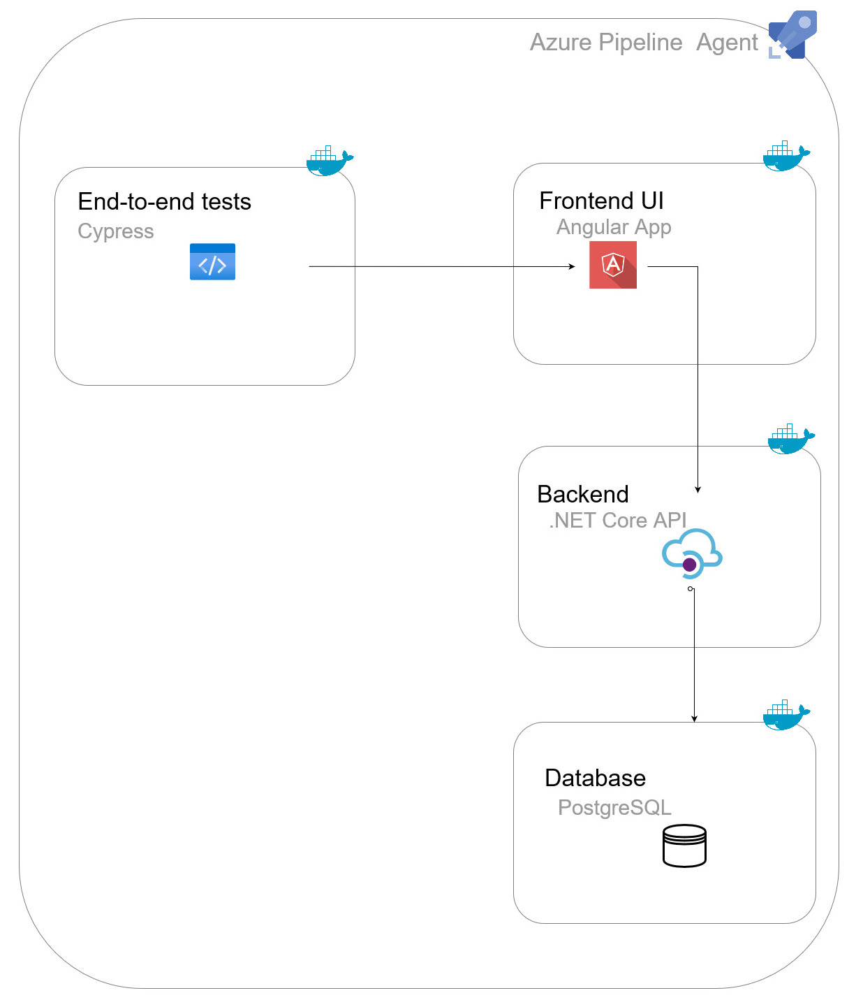

+++
title = 'Run end-to-end tests in CI pipeline'
date = 2024-04-04T15:37:06-05:00
featured_image = 'overview-design.png'
draft = false 
+++

# Overview
In this post, I will provide a comprehensive overview of setting up end-to-end tests to run in the CI/CD pipeline. 
End-to-end tests verify the entire application, including the front-end, back-end APIs, and the database. 
Although I could run unit tests, integration tests, and end-to-end tests independently, combining them into an 
end-to-end testing suite offers a more holistic view of the application's overall functionality and behavior.

I plan to write up the details on each type of test, challenges encountered, and solutions in future posts.

### Why move tests to CI/CD pipeline?

As always, it's good to start by asking (the "why") the reason you are about to embark on this endeavor. 

So, why would you want to move your tests to CI/CD pipeline?

Moving unit, integration and end-to-end tests to a CI/CD pipeline brings numerous advantages for software development teams. 
Firstly, it automates the testing process, ensuring that tests are executed automatically with every code change. 
This leads to early detection of bugs and issues, promoting better code quality and reducing the likelihood of regressions.

Moreover, it facilitates faster feedback loops for developers, enabling them to address issues promptly.
Consequently, this increases confidence in deployments, as code changes undergo thorough testing before reaching the production environment.

### End result

The end goal is to run tests to exercise all the layers of the application in the CI/CD Pipeline.

If the tests do not succeed, we have an option to pause the deployment, notify the team of the issues. 

# Microsoft vs self-hosted  build agents

Azure DevOps hosted agents might not have enough resources to run the tests. 
The tests for the front-end Angular application in particular can be memory intensive. 
On the project that I worked on, these end-to-end tests were not able to run on the default build agent. 
The test would reach the agent timeout of 60 minutes and never complete. 
We had to set up a self-hosted agent on a machine that has enough memory to finish running all the tests. 

