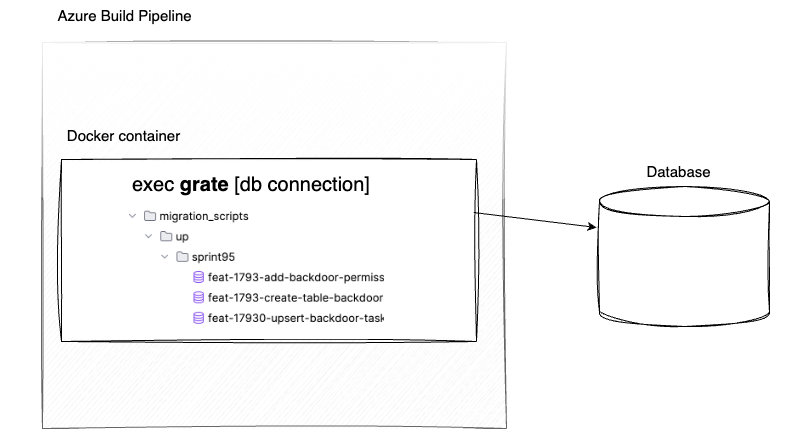

+++
title = 'Database Change Management'
date = 2024-05-07T15:37:06-05:00
featured_image = 'azure-ci-cd-grate.png'
draft = false 
toc = true  
+++

So, you have database changes—either schema or data changes—that need to be implemented and rolled out across various environments.

One approach could be to connect directly to each database server and execute scripts. However, you might not—and indeed, probably should not—have direct read/write access to certain environments like beta or production.

Additionally, consider if a client posed the following questions; would you be able to easily respond?

- What is the state of the database in our Production environment?
- What database changes are being deployed with the next release?
- What is the reason for a specific change?
- When was a specific table or data changed?
- Who approved database update made three months ago?
 
It would be beneficial to have a process that systematically answers all these questions 
and relieves you of the mundane tasks, freeing you up for more engaging activities.


## Overview of the process

At a high level, the process is:

1. Version control your SQL scripts
2. Set up CI/CD pipeline to run scripts on a database in specified environment



Ideally, developers will only need to worry about writing their SQL scripts to make changes to the database.
The deployment process should then automatically handle pushing these changes to the appropriate environments at designated times, with approvals from the appropriate parties.


### Version control SQL scripts
Why put SQL scripts into version control?

Committing SQL scripts to source control answers questions such as who created the change,
when it was made, and why. Of course, the level of detail depends on the information included 
in your commit messages. Besides the message itself, referencing the user story or bug number 
associated with the change can be beneficial. This practice further helps clarify the reason for the change.

Once this is done, anyone can look at version control history and figure out why this change was there.
This helpful not just for SQL scripts but for any code that effects application or infrastructure. 

### CI/CD Pipeline

After the SQL scripts are pushed to version control,
CI/CD pipeline is triggered.

Pipeline does the following:

- Pulls source code that contains SQL scripts from version control.

- Build a docker image that encapsulates SQL scripts along with the tool to run these scripts. 

- Using that image, it spins up a container that runs the scripts against database in specified environment

Here is a sample definition of a pipeline that builds the image and deploys it to different environments.

It uses KeyVault to get database connection. 

It also uses a template for a common deployment part. 

```yaml
trigger: none

resources:
  - repo: self

variables:
  vmImageName: 'ubuntu-latest'
  dockerfilePath: '$(Build.SourcesDirectory)/src/your-project/Dockerfile'
  dockerRegistryServiceConnection: '...'
  imageRepository: 'datamigration'
  keyVaultDevelopment: 'kv-you-app-dev'
  keyVaultDemo: 'kv-your-app-demo'
  keyVaultProduction: 'kv-your-app-prod'

stages:
  #
  # Using the Dockerfile in this directory, build an image that contains SQL scripts to be run.
  #
  - stage: Build
    displayName: 'Build and push image with SQL scripts'
    jobs:
      - job: Docker_Build_Push
        displayName: 'Docker Build and Push'
        pool:
          vmImage: $(vmImageName)
        steps:
          - checkout: self
            #
            # Find latest backend version. Use it to version database migration 
            #
          - powershell: |
              $latestTag = git tag --sort=-version:refname | head -n 1

              # Check if $latestTag starts with 'v' and remove it
              if ($latestTag -match '^v') {
                  $latestTag = $latestTag.Substring(1)
              }

              Write-Host "##vso[task.setvariable variable=LatestApiVersion;isOutput=true]$latestTag"
            name: GetLatestVersion
          #
          # Build Docker image and tag it with latest version
          #
          - task: Docker@2
            displayName: 'Build and push an image to container registry'
            inputs:
              command: 'buildAndPush'
              repository: $(imageRepository)
              dockerfile: $(dockerfilePath)
              containerRegistry: $(dockerRegistryServiceConnection)
              tags: |
                $(GetLatestVersion.LatestApiVersion)

  #
  # Deploy to Development 
  #
  - stage: Development_Deployment
    displayName: 'Development'
    dependsOn: Build
    jobs:
      - template: deploy-template.yml
        parameters:
          environmentName: Dev
          imageRepository: $(imageRepository)
          keyVaultName: $(keyVaultDevelopment)


  #
  # Deploy to Production 
  #
  - stage: Production_Deployment
    displayName: 'Production'
    dependsOn:
      - Build
      - Demo_Deployment
    jobs:
      - template: deploy-template.yml
        parameters:
          environmentName: Production
          imageRepository: $(imageRepository)
          keyVaultName: $(keyVaultProduction)


```

Here is the definition of the 'deploy-template' used in the main pipeline definition
```yaml

parameters:
  - name: keyVaultName
    type: string
    default: ''
  - name: imageRepository
    type: string
    default: ''
  - name: environmentName
    default: ''

jobs:
  - deployment: Deploy_to_${{ parameters.environmentName }}
    displayName: Deploy scripts to ${{ parameters.environmentName }}
    environment: ${{ parameters.environmentName }}
    variables:
      containerRegistryUrl: 'myregistry.azurecr.io'
      latestVersion: $[ stageDependencies.Build.Docker_Build_Push.outputs['GetLatestVersion.LatestApiVersion'] ]
      migrationResultsDirectory: '$(Build.SourcesDirectory)/migration_output/'
    strategy:
      runOnce:
        deploy:
          steps:
            # Get database connection from Azure Key Vault 
            - task: AzureKeyVault@2
              displayName: 'Get db connection string from Key Vault'
              inputs:
                azureSubscription: 'Pay-As-You-Go (8f921b8d-4fe2-474e-944d-1791acb0ab40)'
                KeyVaultName: ${{ parameters.keyVaultName }}
                SecretsFilter: '*'
                RunAsPreJob: false

            # Login to Docker registry
            - task: Docker@2
              displayName: Docker Login
              inputs:
                containerRegistry: 'MyRegistry'
                command: 'login'

            # Spin up docker container that will execute scripts against a database
            - script: |
                IMG_URL=${{ variables.containerRegistryUrl }}/${{ parameters.imageRepository }}:$(latestVersion)
                docker run --name data_migration -t -e "MIGRATIONS_CONNECTIONSTRING=$(db-connection)" -e "VERSION=$(latestVersion)" $IMG_URL --verbose
              displayName: 'Run Data Migration Scripts'

```


### SQL migration runner 

To help us manage database changes in a more systematic and reliable manner, we can let's rely on some tools.


If you are using Microsoft SQL Server, then Microsoft has [a tool for you](https://visualstudio.microsoft.com/vs/features/ssdt/) 
to automate this process. However, this tool is Microsoft specific. 

There are options that are more tech stack agnostic.

One such option is the [Grate - SQL scripts migration runner](https://erikbra.github.io/grate/). 

This tool uses conventions to make SQL deployments more systematic. 
Since it just executes SQL scripts, you can use it to deploy to a variety of databases.

I was able to use Grate on a couple of projects that included PostgreSQL and MySQL databases.


### Containerize dependencies

It's helpful to have the tool along with the SQL scripts containerized so that we can run 
it in any environment including testing on our local machine before deploying it.

The following is an example of a Dockerfile definition that 
copies SQL scripts, installs and runs the Grate tool against specified database. 

```dockerfile
FROM erikbra/grate:1.6.1 as migrations

WORKDIR /app
RUN mkdir scripts
RUN mkdir migration_output

# copy migration scripts from host to container
COPY "/migration_scripts" "./scripts"

# Create a non-root user and group in the container, set their IDs, 
# and change the ownership of the /app directory to this non-root user.
RUN addgroup -g 1001 -S data_migration_group && \
    adduser -u 1001 -S data_migration_user -G data_migration_group

RUN chown -R data_migration_user:data_migration_group /app

USER data_migration_user

# Run migration tool 'Grate' and capture the output.
ENTRYPOINT ./grate \
    --files=./scripts \
    --databasetype postgresql \
    --connectionstring="$MIGRATIONS_CONNECTIONSTRING" \
    --version=$VERSION \
    --silent \
    --outputPath=./migration_output
```


