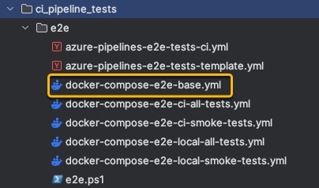

+++
title = 'Docker Compose Application'
date = 2024-04-09T07:43:54-05:00
featured_image = 'docker-header.jpeg'
draft = false
tags = ["docker", "ci-cd", "azure"]

+++

# Overview
The end-to-end tests set-up described in my previous post, is a series of docker containers that talk to each other.
This set up is nice because, it will run on any machine. This allows you to test your app locally or in CI/CD pipeline.
In this short post, I show the set up I used to run end-to-end tests.


# Docker compose set up
In order to spin up containers locally or do so in the CI pipeline,
and to run just the "smoke tests" or for all tests, I created multiple docker compose files.

The common functionality is extracted into "base" docker compose file from which others will extend.




# Base docker file

Here is the base docker compose file from which others extend.

It spins up all layers of the application and starts end-to-end tests.

```dockerfile
#
# This definition contains the common configuration. It is extended by other compose files.
#

version: "3.8"

services:

  # Cypress tests
  cypress:
    image: cypress/included:10.11.0
    container_name: cypress
    working_dir: "/e2e"
    volumes:
      - ../../cypress/e2e:/e2e/cypress/e2e:ro # the tests are here
      - ../../node_modules:/e2e/node_modules:ro # to get this, we run npm install before doing compose
      - ../../cypress.config.ts:/e2e/cypress.config.ts:ro
      - ../../tsconfig.json:/e2e/tsconfig.json:ro
      - ../../cypress/fixtures:/e2e/cypress/fixtures:ro
      - ../../cypress/plugins:/e2e/cypress/plugins:ro
      - ../../cypress/support:/e2e/cypress/support:ro
      - ../../cypress/tsconfig.json:/e2e/cypress/tsconfig.json:ro
    # run all tests
    entrypoint: cypress run --browser=chrome --config video=false --spec 'cypress/e2e/**/*.cy.ts'
    environment:
      - CYPRESS_baseUrl=http://UI_for_ci_e2e_tests:4200
    networks:
      - app-network
    depends_on:
      UI_for_ci_e2e_tests:
        condition: service_healthy

  # UI angular app
  UI_for_ci_e2e_tests:
    build:
      context: ../../
      dockerfile: ./e2e-tests.Dockerfile
    image: ui_for_ci_e2e_tests
    container_name: UI_for_ci_e2e_tests
    ports:
      - "4200:4200"
    networks:
      - app-network
    healthcheck:
      test: curl -f http://localhost:4200 || exit 1
      start_period: 120s
      interval: 40s
      timeout: 15s
      retries: 5
    depends_on:
      API_for_ci_e2e_test:
        condition: service_healthy

  # Api tests are housed in this container
  API_for_ci_e2e_test:
    container_name: API_for_ci_e2e_test
    image: api_for_ci_e2e_test
    ports:
      - "5001:5001"
    environment:
      ASPNETCORE_ENVIRONMENT: TestingE2E
    networks:
      - app-network
    depends_on:
      db_server:
        condition: service_healthy
    healthcheck:
      test: curl -X POST http://localhost:5001/api/v1/access/signin || exit 1
      start_period: 20s
      interval: 20s
      timeout: 15s
      retries: 5

  # db used for e2e tests is housed in this container
  db_server:
    image: postgres:15
    container_name: postgres
    ports:
      - "5432:5432"
    environment:
      POSTGRES_DB: TestDB 
      POSTGRES_USER: tester
      POSTGRES_PASSWORD: tester
    networks:
      - app-network
    healthcheck:
      test: [ "CMD", "pg_isready", "-U", "tester", "-d", "TestDB"]
      interval: 10s
      timeout: 5s
      retries: 5


networks:
  app-network:
    driver: bridge
```

Note that in addition to specifying that a service `dependsOn` another, there is also a `healthCheck`.

Healthcheck needs to be done in order to know that not only the container is up but the service that we
want to call is ready to receive requests. 


