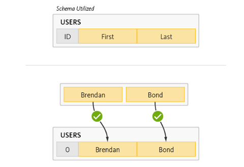
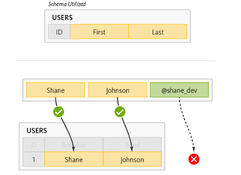
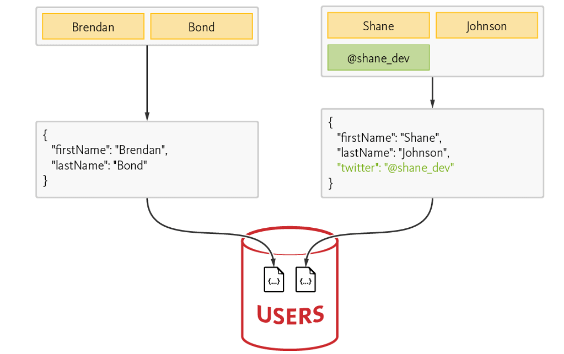
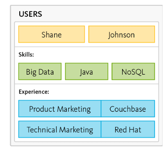
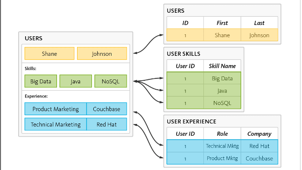
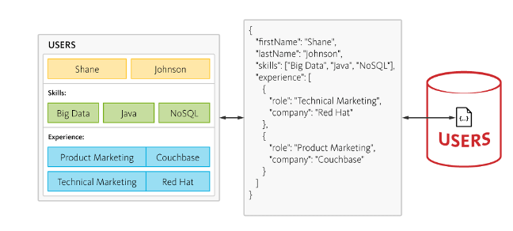

# Overview

On my latest project, I had the opportunity to explore an alternative to relational databases: Document Databases. Document Databases belong to a category called NoSQL databases.

I found a couple of advantages of using a document database compared to a traditional relational database, which I will demonstrate with an examples below.

## Schema flexibility

Let's say you have a table that stores user's information.  Let's store just first and last name. What do we do when we design using relational database? We create a table users with two columns that store first and last name respectively.

### Relational way

 

At a later point, we decide that we also want to store user's twitter handle. 
Where would it go?  We could create a new column in user table or have a new table 
that stores user social media information. 

In either case, we need to update database schema. 
PAIN! Deal with scripts and red tape that goes along with updating database schema in different environments.

### Document way

Let's see how it's done using a document database. With a document database, data is stored as a document, typically in the form of a JSON object. 

    
This approach provides flexibility, allowing us to modify our schema without the need to create additional tables or columns; we can simply add a new property to the JSON object.

## Eliminate Data Transformation

One other goal of a document database is to reduce data transformation. Let me demonstrate with the example below.

### Relational way

Suppose we wish to store a person's profile similar to that of LinkedIn.

### Shredding the data

What is typically done in a relational database is the normalization of data. We break down different characteristics of the information into their own tables with their own columns. Essentially, we 'shred' the data.

Now, to retrieve the information we need, we query data from multiple tables and hope for performant joins that don't cause delays.

Essentially, we pay the price twice: once by creating multiple tables with their own columns and relationships, and then with the need for queries from multiple tables. Both of these steps are prone to errors and performance issues.

### Document database

One of the features of a document database is to store the data the way you need it. If you're going to retrieve a user's profile information this way most of the time, then store it accordingly—as an entire profile stored as a JSON object.

Store it in one table and query it by user's id or email. Done!

## Conclusion

In this post, I highlighted just a couple of advantages that I see in opting for document databases. However, there are some disadvantages that I found. For example, while you can quickly select columns from a table and scan it for the data you need in a traditional relational database, since the JSON data is stored in one column in a document database, you need to view that JSON and write a query to parse it. Fortunately, with ChatGPT, writing these queries isn't a big deal.

There are other considerations...but that's a topic for next post. 

