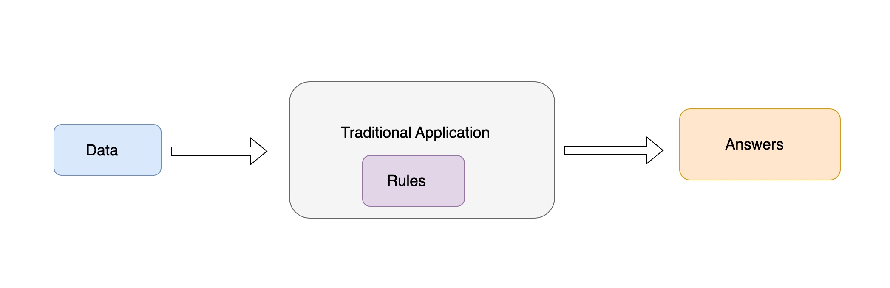
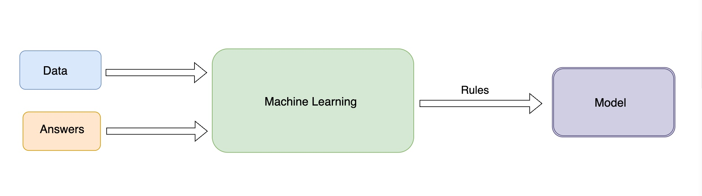
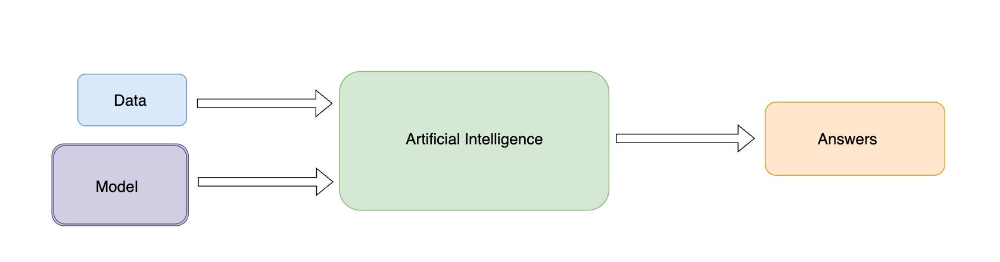

+++
title = 'Machine Learning and AI'
date = 2024-04-20T07:24:58-05:00
featured_image = 'machine-learning-overview.jpg'
toc = true
tags = ["ai", "machine-learning"]
+++

Earlier this week, I participated in a [two-day, hands-on introductory
course on Machine Learning and AI](https://www.improving.com/services/training/ai-ml-application-developers/), which was useful for someone new to the field like myself.
The course helped me understand various concepts I had been curious about, including:

- The relationship between Machine Learning and AI.
- The definition of a "model" in this context and the process of "training" it.
- Clarification on terms like "Hugging Face" and "Llama."
- The importance of quality data in machine learning projects.

Each of these topics became clearer after this course.

This post is the starting point of my journey into understanding artificial intelligence and machine learning.

To understand the concept of machine learning, it is helpful to contrast it with our "traditional" application development. 

## Traditional applications
When we write "traditional applications" we program business rules into the application. 
Then we feed the application data and using rules baked into the application, we get answers.

What if we don't know the rules?

What if we just have a set of "answers"
along with related data that might have contributed to those answers?

This is where machine learning comes in. 

## Machine learning

Machine learning is the process of figuring out rules given the answers
and the data that contributed to those answers.

_Machine learning gives computers the ability to learn without being explicitly programmed._ 

### Model
The result of this learning is a model, which at its core is a mathematical 
function that has been trained to recognize patterns in data. Given an input, this 
function predicts answers based on the data it has been exposed to. 
The accuracy and performance of the model can be enhanced by 'training' it on more data.

### Training the model
Models are trained by feeding them large amounts of data. 
During this training process, the model adjusts its parameters to minimize 
the error between its predictions and the known outcomes. 
This process of adjusting parameters to reduce prediction error is called 'fitting'.

The better the model, the more accurate are its predicted answers. 

## Model marketplace

You can train your models, or you can obtain pre-trained models 
from open marketplaces like [Hugging Face](https://huggingface.co/).
These models can be used 'as is' or can be extended to meet specific needs.
So, you can grab a model from Hugging Face and use it as a starting point. 
Then, use your data to train this model to be more accurate with your data.

## Conclusion
As with any new endeavor, it's vital to grasp the foundational concepts at the outset.
Understanding the basics of machine learning, its integration with traditional application development, 
and its ties to the broader scope of artificial intelligence is crucial. 
This initial knowledge serves as a roadmap for navigating the field and 
enables further exploration and progress.