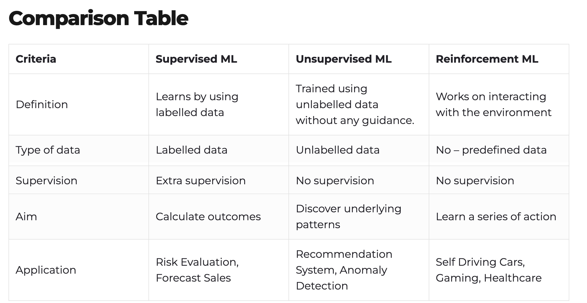

+++
title = 'Machine Learning - Full Picture'
date = 2024-05-01T07:24:58-05:00
featured_image = 'ml-learning-data.png'
toc = true
tags = ["ai", "machine-learning"]
+++

This post continues our series on  [AI and ML]( "Machine Learning - AI"). 
The aim is to enhance understanding of the main types of machine learning, 
explain the reasons for choosing the appropriate ML approach, and describe the data requirements for each method.

### Ways to learn

There are three main **ways of learning** in machine learning.  
 
- **Supervised** learning
- **Unsupervised** learning
- **Reinforcement** learning

How would one choose an appropriate learning method?

## Appropriate ML method

Selecting the appropriate machine learning method depends on your objectives. 

If you're looking for **direct answers** or predictions, **Supervised** Machine Learning is the way to go.

If you aim to discover **hidden patterns** or intrinsic structures within your data, then **Unsupervised** Machine Learning is suitable. 

For scenarios where you want an AI to **learn how to make decisions** or play a game through trial and error, **Reinforcement** Machine Learning is the ideal choice.

One difference between supervised and unsupervised learning is 
the data used to train the model.

Supervised ML uses _labeled_ data and unsupervised ML uses _unlabeled_ data.

So what is labeled data?

### What is "labeled" data?

Labeled data is raw information that has been tagged (or labeled) to show what it represents. 
It provides context about the data.
For example, emails in a dataset might be _labeled_ as "spam" or "not spam," helping a machine learning program understand and use this information.

This labeling can be done manually by a person, semi-automatically (person + some ML), or crowdsourced where a community of people work together to classify the data.

There is a whole ecosystem around creating and sharing labled data. 

Tools like [Label Studio](https://labelstud.io/) allow you to label the data and places 
like [HuggingFace Datasets](https://huggingface.co/datasets) share labeled data that you can use to train your models. 

For more information see this [post](https://www.datacamp.com/blog/what-is-labeled-data) about labeled data. 

### Reinforcement Learning
Reinforcement learning is its own beast. It does not require a set of data. 
Instead, the training data is collected through the responses from an agent.

What/who is this agent? 

The agent is a _training algorithm_.

This algorithm determines if the AI model picked an answer that leads to a better _state_. 
Also, note that there isn't a "right answer" per se, but rather a _strategy_ that maximizes _rewards_ over time.

The algorithm updates its strategy based on the rewards received from the _environment_. 
Note that this environment changes according to the actions performed on it. Hence, it's 
often referred to as dynamic environment.

For more details  about RL see [this post](https://www.spiceworks.com/tech/artificial-intelligence/articles/what-is-reinforcement-learning/).  

For the brave, here is a more detailed explanation of [different RL algorithms.](https://spinningup.openai.com/en/latest/spinningup/rl_intro2.html)

...

That's all for this post. It's tough to know when to stop because there's so much to dive into with each method. 
I'm trying to keep these posts quick and to the point.
