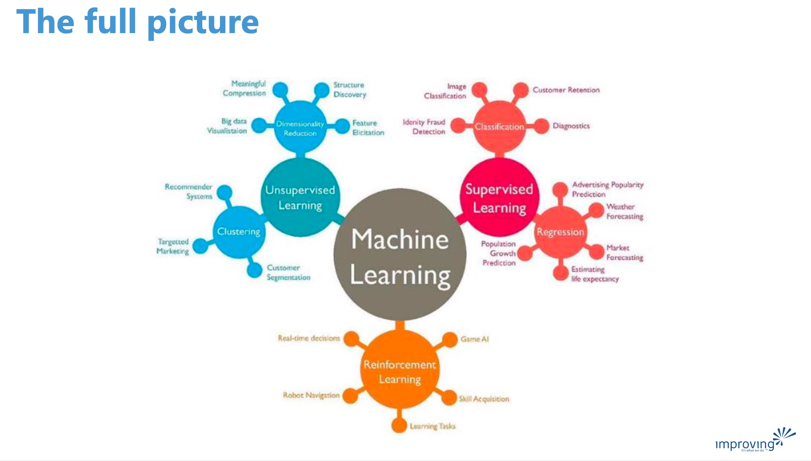

+++
title = 'Machine Learning - Full Picture'
date = 2024-04-25T07:24:58-05:00
featured_image = 'full-picture.jpg'
toc = true
tags = ["ai", "machine-learning"]
draft = true 
+++

There are three main ways of learning in machine learning.  
 
- Supervised learning
- Unsupervised learning
- Reinforcement learning

Here is comparison table of what the differences are. 

For more details see [this article](https://www.aitude.com/supervised-vs-unsupervised-vs-reinforcement/).

## Appropriate ML method

Selecting the appropriate machine learning method depends on your specific objectives. 

If you're looking for direct answers or predictions, Supervised Machine Learning is the way to go.

If you aim to discover hidden patterns or intrinsic structures within your data, then Unsupervised Machine Learning is suitable. 

For scenarios where you want an AI to learn how to make decisions or play a game through trial and error, Reinforcement Machine Learning is the ideal choice."

# Note about data

As you can see from definition, the difference between supervised and unsupervided ML is 
the data it uses. Supervised ML uses _labeled_ data.

### What is "labeled" data?

Labeled data is raw information that has been tagged (or labeled) to show what it represents. 
For example, emails in a dataset might be labeled as "spam" or "not spam," helping a machine learning program understand and use this information.

This labeling can be done manually by a person, semi-automatically (person + some ML), or crowdsourced. 

This process is crucial for ensuring the quality of the data.

For more information [see this post](https://www.datacamp.com/blog/what-is-labeled-data) about labeled data. 

