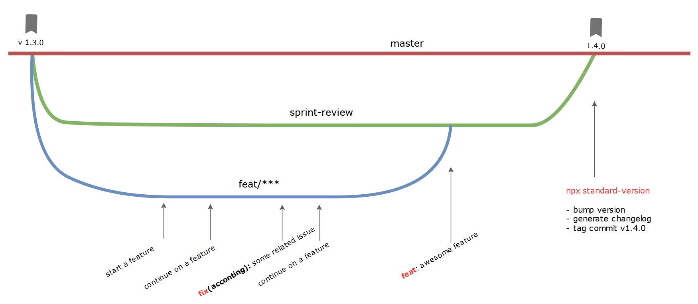

+++
title = 'Release management'
date = 2024-04-03T09:24:43-05:00
draft = false
featured_image = 'conventional-commits.jpg'
toc = true
+++

## Overview

Throughout the lifetime of your project, you will most likely wonder (or will be asked) the following:
- what is currently released in Production or your other environments? 
- what features or bug fixes are slotted for the next release?
- are there any breaking changes?!  

This is where a process of release management comes in. 

The goal of release management is to communicate what has changed and what developers and users can expect upon the release of changes. 

In this post I will demonstrate how to set up a release management process that will help users and developers to know what is released. 


## Process

As always, it's best to automate as much as possible to avoid more busy work than we already have. 

So we are going to lean on a process that will help us "fall in the pit of success". 

To achieve this, we'll utilize some tools. 

### Conventional Commits

What is better than clear and informative commit messages: Messages that will allow you to generate changelog and version your software.

One of the ways to do this is to utilize a standard called [Conventional Commits](https://www.conventionalcommits.org/).

It is a way for developers to communicate what changes they are making by using a standardized prefixes in their messages. 

Some examples include:
``` 
feat: new feature
fix(scope): bug in scope
feat!: breaking change / feat(scope)!: rework API
chore(deps): update dependencies
```

When developers are ready to check in their code, they prefix their commit messages with the type of change they are making.

Once the messages are prefixed with these conventions, we can use tools to generate a changelog and version our software. 

Which is what comes next...

### Standard Version

When we are ready to release the new version of our software, we can utilize a tool to automatically version our software package and generate a changelog.

There are several tools available that parse conventional commits and generate a changelog while also bumping the version.

If you are using GitHub for your repository, consider checking out [Please Release](https://github.com/googleapis/release-please?tab=readme-ov-file#release-please) 
For people who use Azure DevOps Git, there is a deprecated version called [Standard Version](https://github.com/conventional-changelog/standard-version?tab=readme-ov-file#standard-version), which still functions but is no longer supported at this point.

In my instance our repo was a Git in Azure DevOps and we used Standard Version like so:


1. Check if the version number and Changelog look okay.

    `npx standard-version --dry-run`
2. Run the previous command (without dry-run it will make changes and commit them)

     `npx standard-version`
3. Push your changes along with tags 

     `git push --follow-tags origin master`

The standard version will determine the next iteration of your software and generate a changelog.
It achieves this by analyzing commit messages and ascertaining the changes made, utilizing conventional commit prefixes.
Therefore, it is important to ensure that you adhere to conventional commits.

Here is an overview of where these steps are in the workflow. 




