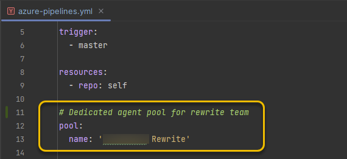

+++
title = 'Self Hosted Build Agent'
date = 2024-06-21T01:24:43-05:00
draft = true 
featured_image = 'devops-azure-side-by-side.jpg'
toc = true
tags = ['ci-cd', 'azure', 'yaml']
+++

## What is a build agent?

Let's start out with nomenclature.  

A build agent in DevOps world is a dedicated machine (or a most likely a docker container)
that runs your build/deploy commands for you in the "cloud" (Azure or AWS). 

Microsoft provides you with their hosted agent
that comes [pre-configured with software](https://learn.microsoft.com/en-us/azure/devops/pipelines/agents/hosted?view=azure-devops&tabs=yaml#software).

For more information [see Microsoft's documentation](https://learn.microsoft.com/en-us/azure/devops/pipelines/agents/agents?view=azure-devops&tabs=yaml%2Cbrowser)

## Why would you want to host your own build agent?

There a [number of reasons](https://learn.microsoft.com/en-us/azure/devops/pipelines/agents/hosted?view=azure-devops&tabs=yaml#capabilities-and-limitations) 
why you would want to host your own agent.
On the project I worked on, hardware specs were insuficient for worklaod.

At present moment Microsoft-hosted agent 
is provisioned with 2 core CPU, 7 GB of RAM, and 14 GB of SSD disk space,
see [more details here](https://learn.microsoft.com/en-us/azure/devops/pipelines/agents/hosted?view=azure-devops&tabs=yaml#hardware).

For small projects that don't require many resources this might be sufficient. 
However, for projects that involve more process-intensive tasks, the hosted agent configuration most
likely won't suffice.

An example of a process-intensive task is running tests for a front-end Angular application. This task,
in particular, can be memory-intensive. End-to-end tests that run with Cypress are another example. These tests are both CPU and memory-intensive.

On our project, the end-to-end tests were not able to complete in the alloted time.
The pipeline would reach the timeout of 60 minutes.  

This is why we chose to set up a self-hosted agent on a machine with enough memory to 
finish running the tests.

## Set up agent

The virtual machine doesn't have the agent running by default 
however there is an extension that Microsoft provides. 
Enable that extension and you have a build agent running on your virtual machine.

https://learn.microsoft.com/en-us/gaming/azure/reference-architectures/azurecloudbuilds-4-buildagent

## Configure Azure to use newly created agent

Create a new agent pool

Configure agent pool

Once configured you should see agents being utilized.

## Configure your builds to use the new agent pool

In your CI/CD config, set the agent pool
