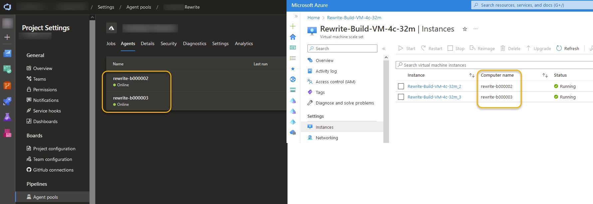

+++
title = 'Self Hosted Build Agent for CI/CD pipeline'
date = 2024-06-21T01:24:43-05:00
draft = true 
featured_image = 'devops-azure-side-by-side.jpg'
toc = true
tags = ['ci-cd', 'azure', 'yaml']
+++

# Context

So you have a typical project with a backend API and a frontend app built with React or Angular. 
You want to ensure that every time you push changes to production, they are thoroughly tested and 
deployed. To achieve this, you set up a CI/CD pipeline that handles the building, testing, and 
deployment processes automatically.

At first, everything works smoothly, but as your project grows, you notice the pipeline is taking 
longer to complete. Eventually, it might even timeout. Why is this happening, and how can it be fixed?

## Nomenclature

Let's start out with nomenclature.

### What is a pipeline?

A CI/CD pipeline is a process that automates the steps of software development, from writing
code to deploying it to production, ensuring new code changes are automatically tested and 
integrated for reliable and faster updates. This pipeline is created by writing scripts or 
configuration files that define the steps for building, testing, and deploying code, which 
are then executed by CI/CD tools like Jenkins, GitHub Actions, or Azure Pipelines.

### What is a build agent?

A build agent in DevOps world is a dedicated machine (or a most likely a docker container)
that runs before mentioned scripts that build, test and deploy your application. 

## Why would you want to host your own build agent?

Build agents can become a bottleneck, as their performance directly affects the speed of the entire pipeline.

Microsoft provides you with their hosted agents that come with
[pre-configured](https://learn.microsoft.com/en-us/azure/devops/pipelines/agents/hosted?view=azure-devops&tabs=yaml#software) software.

There are [several reasons](https://learn.microsoft.com/en-us/azure/devops/pipelines/agents/hosted?view=azure-devops&tabs=yaml#capabilities-and-limitations)
to host your own agent, and in a project I worked on, the hardware specs
of hosted agents were insufficient for our workload.

At present moment Microsoft-hosted agent 
is provisioned with 2 core CPU, 7 GB of RAM, and 14 GB of SSD disk space,
see [more details here](https://learn.microsoft.com/en-us/azure/devops/pipelines/agents/hosted?view=azure-devops&tabs=yaml#hardware).

For small projects that don't require many resources this might be sufficient. 
However, for projects that involve more process-intensive tasks, the hosted agent configuration most
likely won't suffice.

An example of a process-intensive task is running tests for a front-end Angular application. This task,
in particular, can be memory-intensive. End-to-end tests that run with Cypress are another example. These tests are both CPU and memory-intensive.

On our project, the end-to-end tests were not able to complete in the alloted time.
The pipeline would reach the timeout of 60 minutes.  

This is why we chose to set up a self-hosted agent on a machine with enough memory to 
finish running the tests.

## Set up self-hosted agent

The virtual machine doesn't have the agent running by default 
however there is an extension that Microsoft provides. 
Enable that extension and you have a build agent running on your virtual machine.

https://learn.microsoft.com/en-us/gaming/azure/reference-architectures/azurecloudbuilds-4-buildagent

## Configure Azure to use newly created agent

Create a new agent pool

Configure agent pool

Once configured you should see agents being utilized.

## Configure your builds to use the new agent pool

In your CI/CD config, set the agent pool
