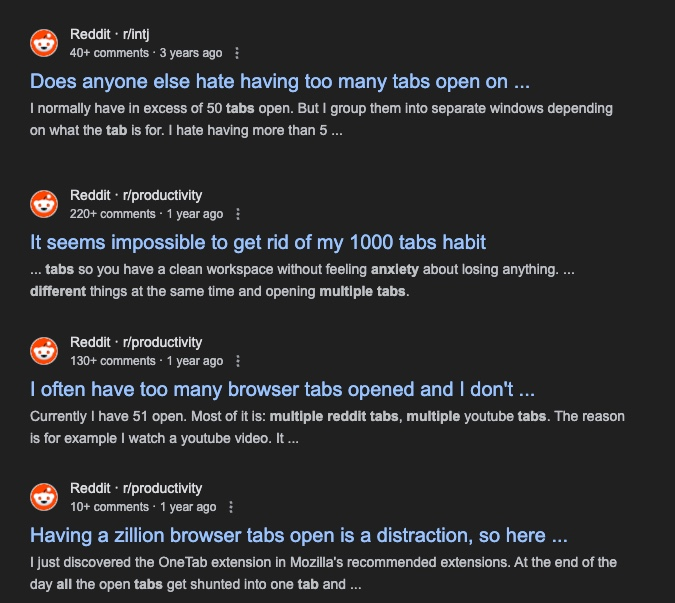

+++
title = 'Tabs and notes'
date = 2024-08-02T01:24:43-05:00
featured_image = ''
tags = ['workflow']
draft = true
+++

We've all experienced this. You are reasearching a solution or a product or service,
open up a google search, get your list of links and start opening websites.
Those sites also provide with relevant resources to other websites. 
Beofre you know it, you have ten tabs open. 

Then you accidently close the browser and now you lost all those relevant tabs. 

All these tabs are weighing down on you mentaly. 
It's mental energy that you have to spend to keep mutliple things in mind. 

To me this is a symptom of a missing component or process. 
What are we actually suppose to do when we are researching. 
We need to take notes. 
If we take notes and include the link for refernece, we don't have to worry about keeping that window tab open. 

